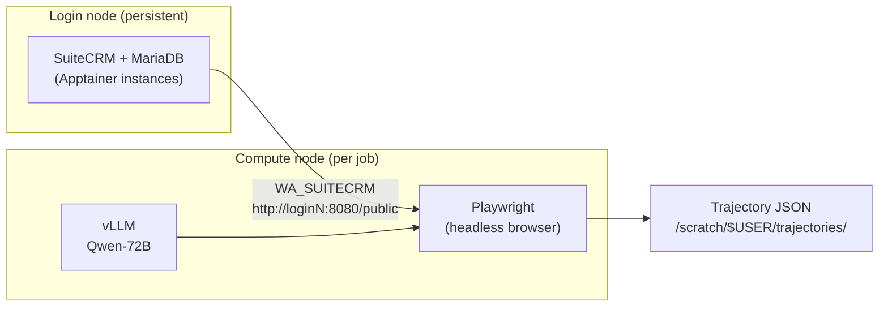

# ICRL Safety

Constrained fine-tuning of LLM orchestrators using Inverse Constraint Reinforcement Learning on [ST-WebAgentBench](https://github.com/segev-shlomov/ST-WebAgentBench).

This guide covers **everything needed to run the full pipeline on an Alliance / Compute Canada cluster** (tested on Fir with SLURM, Apptainer, and H100 GPUs).

---

## What runs where

ST-WebAgentBench tasks operate a real CRM web app (SuiteCRM) through Playwright inside SLURM jobs. The LLM actor runs via vLLM on the job's GPUs.



| Component | Where | Why |
|-----------|-------|-----|
| Python venv + code | `/scratch/$USER/venvs/icrl_v4` | Fast I/O, shared across jobs |
| SuiteCRM + MariaDB | Login node (Apptainer) | Stays up across jobs; compute nodes reach it over the cluster network |
| vLLM + Playwright | Compute node (inside SLURM job) | Needs GPUs; browser must co-locate with the model |
| Trajectories | `/scratch/$USER/trajectories/` | Persistent output |

### Dependencies (third-party repos)

| Repo | Upstream | Our use |
|------|----------|---------|
| [BrowserGym](https://github.com/ServiceNow/BrowserGym) | ServiceNow | Browser env core |
| [ST-WebAgentBench](https://github.com/segev-shlomov/ST-WebAgentBench) | segev-shlomov | Benchmark tasks + evaluators |

We maintain **forks** with small compatibility patches. Never push directly to upstream.

---

## Prerequisites

- Alliance cluster account with GPU allocation (e.g. `def-s2ganapa`)
- SSH access to login node
- GitHub account with forks of BrowserGym and ST-WebAgentBench
- API keys: `OPENROUTER_API_KEY` (required for collection), `HUGGINGFACE_TOKEN` (for model download / fine-tuning)

### Modules used

```bash
module load gcc python/3.12 arrow/23.0.1 cuda/12.1 cudnn/8.9   # Python jobs
module load apptainer/1.4.5                                     # SuiteCRM
```

---

## Step 1 — Clone and one-time setup

### 1a. Fork upstream repos (browser, once)

1. Fork [BrowserGym](https://github.com/ServiceNow/BrowserGym)
2. Fork [ST-WebAgentBench](https://github.com/segev-shlomov/ST-WebAgentBench)

### 1b. Clone icrl and run setup

```bash
git clone git@github.com:YOUR_USER/icrl.git ~/icrl
cd ~/icrl

export GITHUB_USER=YOUR_USER
export REPOS_ROOT=$HOME                    # clones BrowserGym + ST-WebAgentBench here
bash scripts/setup_cluster.sh
```

`setup_cluster.sh` will:

- Clone your forks of BrowserGym and ST-WebAgentBench
- Create venv at `/scratch/$USER/venvs/icrl_v4`
- Install icrl, BrowserGym, ST-WebAgentBench, vLLM, Playwright deps
- Download NLTK data
- Write `activate_icrl.sh` with `PYTHONPATH` exports
- Verify 375 ST-WebAgentBench tasks register

**Login-node tip:** Playwright browser download can be slow on login nodes. To skip and install later on a compute node:

```bash
SKIP_PLAYWRIGHT=1 bash scripts/setup_cluster.sh
# then on a GPU node or interactive session:
source /scratch/$USER/venvs/icrl_v4/bin/activate
playwright install chromium
```

### 1c. Activate environment (every session)

```bash
source /scratch/$USER/venvs/icrl_v4/bin/activate
source /scratch/$USER/venvs/icrl_v4/bin/activate_icrl.sh
cd ~/icrl
```

`activate_icrl.sh` sets:

| Variable | Default |
|----------|---------|
| `ICRL_ROOT` | `~/icrl` |
| `STWEBAGENT_ROOT` | `$REPOS_ROOT/ST-WebAgentBench` |
| `BROWSERGYM_ROOT` | `$REPOS_ROOT/BrowserGym` |
| `PYTHONPATH` | `icrl/gridworld` + `icrl/src` |

---

## Step 2 — Configure environment variables

```bash
cp .env.example .env
cp $STWEBAGENT_ROOT/.env.example $STWEBAGENT_ROOT/.env
```

Edit **`~/icrl/.env`**:

```bash
OPENROUTER_API_KEY=sk-or-...          # required for trajectory collection
OPENAI_API_KEY=sk-...                 # optional
HUGGINGFACE_TOKEN=hf_...              # required for HF model weights
WA_SUITECRM=http://login3:8080/public # set after Step 3 (use your login node hostname)
```

Edit **`$STWEBAGENT_ROOT/.env`** (benchmark reads web-app URLs from here too):

```bash
WA_SUITECRM=http://login3:8080/public
```

> Replace `login3` with the hostname of the login node where SuiteCRM runs (`hostname` on that node).

SLURM jobs load `~/icrl/.env` automatically via `scripts/collect_safe_trajectories.py`. When `WA_SUITECRM` is set, jobs **skip** SuiteCRM startup and connect directly to your login-node instance.

---

## Step 3 — SuiteCRM on the login node (Apptainer)

SuiteCRM is the CRM web app the benchmark clicks through. Easy-tier tasks use task IDs **235–254** (SuiteCRM only).

### Why Apptainer?

- No `subuid` / rootless Podman headaches on Alliance login nodes
- SIF images persist on `/scratch`
- One persistent CRM instance shared by all SLURM jobs

### Image note (June 2026)

Bitnami removed `public.ecr.aws/bitnami/*` on **2026-06-10**. Use frozen legacy images:

| Service | Docker image | SIF path |
|---------|--------------|----------|
| MariaDB | `bitnamilegacy/mariadb:11.4` | `/scratch/$USER/apptainer/mariadb.sif` |
| SuiteCRM | `bitnamilegacy/suitecrm:8` | `/scratch/$USER/apptainer/suitecrm.sif` |

### 3a. Pull SIF images (one-time, ~30 min)

```bash
module load apptainer/1.4.5
mkdir -p /scratch/$USER/apptainer/tmp

export APPTAINER_TMPDIR=/scratch/$USER/apptainer/tmp

apptainer pull /scratch/$USER/apptainer/mariadb.sif \
  docker://bitnamilegacy/mariadb:11.4

apptainer pull /scratch/$USER/apptainer/suitecrm.sif \
  docker://bitnamilegacy/suitecrm:8
```

### 3b. Start SuiteCRM (login node)

**Important flags:**

- Use `apptainer instance **run**` — **not** `instance start` (`start` only runs `appinit`, not MariaDB/Apache)
- Add `--writable-tmpfs` — SIF images are read-only; without this MariaDB fails with `Read-only file system`

**Helper script (recommended):**

```bash
module load apptainer/1.4.5
bash scripts/start_suitecrm_apptainer.sh --wait
```

**Manual commands:**

```bash
module load apptainer/1.4.5
mkdir -p /scratch/$USER/suitecrm/{mariadb,app}

apptainer instance run \
  --writable-tmpfs \
  --bind /scratch/$USER/suitecrm/mariadb:/bitnami/mariadb \
  --env ALLOW_EMPTY_PASSWORD=yes \
  --env MARIADB_USER=bn_suitecrm \
  --env MARIADB_DATABASE=bitnami_suitecrm \
  --env MARIADB_PASSWORD=bitnami123 \
  /scratch/$USER/apptainer/mariadb.sif mariadb

sleep 30

apptainer instance run \
  --writable-tmpfs \
  --bind /scratch/$USER/suitecrm/app:/bitnami/suitecrm \
  --env SUITECRM_DATABASE_HOST=127.0.0.1 \
  --env SUITECRM_DATABASE_PORT_NUMBER=3306 \
  --env SUITECRM_DATABASE_USER=bn_suitecrm \
  --env SUITECRM_DATABASE_NAME=bitnami_suitecrm \
  --env SUITECRM_DATABASE_PASSWORD=bitnami123 \
  --env ALLOW_EMPTY_PASSWORD=yes \
  /scratch/$USER/apptainer/suitecrm.sif suitecrm

until curl -sf http://localhost:8080 > /dev/null 2>&1; do
  sleep 15; echo "$(date +%H:%M:%S) waiting..."
done
echo "SuiteCRM up at http://$(hostname):8080"
```

**First boot takes ~10 minutes** (database initialisation + SuiteCRM install wizard). Subsequent starts take ~30 seconds.

### 3c. Set WA_SUITECRM

```bash
echo "WA_SUITECRM=http://$(hostname):8080/public" >> ~/icrl/.env
# also update $STWEBAGENT_ROOT/.env with the same URL
```

### 3d. Verify SuiteCRM

```bash
curl -sf http://localhost:8080/public -o /dev/null -w 'HTTP %{http_code}\n'
apptainer instance list          # should show mariadb + suitecrm
ss -tlnp | grep -E '3306|8080'  # MariaDB and Apache listening
```

Default SuiteCRM credentials (Bitnami image): **user** / **bitnami**

### 3e. Manage instances

```bash
bash scripts/start_suitecrm_apptainer.sh --status   # list instances
bash scripts/start_suitecrm_apptainer.sh --stop     # stop both
bash scripts/start_suitecrm_apptainer.sh --wait     # restart + wait for HTTP
```

### After a login-node reboot

```bash
module load apptainer/1.4.5
bash scripts/start_suitecrm_apptainer.sh --wait
```

Data persists in `/scratch/$USER/suitecrm/{mariadb,app}` — you do **not** need to re-pull SIF images or re-initialise the DB.

### Optional: load demo data

After first boot, you can seed the CRM with benchmark demo data:

```bash
# if using Docker locally; for Apptainer, exec into the mariadb instance:
apptainer exec instance://mariadb \
  mysql -u bn_suitecrm -pbitnami123 bitnami_suitecrm \
  < $STWEBAGENT_ROOT/suitecrm_setup/init-db/demo_data.sql
```

---

## Step 4 — Verify the full stack

Run on the **login node** (with SuiteCRM up):

```bash
source /scratch/$USER/venvs/icrl_v4/bin/activate
source /scratch/$USER/venvs/icrl_v4/bin/activate_icrl.sh
cd ~/icrl

# 375 tasks registered
python -c "import browsergym.stwebagentbench, gymnasium as gym; \
  print(len([e for e in gym.envs.registry if 'STWebAgent' in e]), 'tasks')"

# icrl env wrapper
python -c "from icrl.envs.stwebagent import STWebAgentEnv; print('OK')"

# No browser or GPU needed
python scripts/smoke_collection.py

# Live browser episode (SuiteCRM must be reachable)
python scripts/run_demo.py --task-id 235 --max-steps 15
```

---

## Step 5 — Submit SLURM jobs

All `slurm/*.sh` scripts use account `def-s2ganapa` and write logs to `logs/slurm/`. Edit `#SBATCH --account=` in each script if your allocation differs.

```bash
cd ~/icrl
mkdir -p logs/slurm
```

### Session checklist

Every time before submitting:

```bash
source /scratch/$USER/venvs/icrl_v4/bin/activate
source /scratch/$USER/venvs/icrl_v4/bin/activate_icrl.sh
cd ~/icrl

# Confirm SuiteCRM is up (on login node)
curl -sf http://login3:8080/public -o /dev/null && echo "CRM OK" || echo "CRM DOWN — run start_suitecrm_apptainer.sh"
```

### 5a. Dry run (no GPU, no browser)

Validates imports, `.env`, and task IDs without starting vLLM or SuiteCRM:

```bash
DRY_RUN=1 sbatch --gres= --mem=4G --time=00:05:00 slurm/gen_safe_demos.sh
tail -f logs/slurm/icrl-gen_*.out
```

### 5b. Safe trajectory collection (main job)

Starts vLLM with **Qwen2.5-72B** (4× H100, tensor-parallel=4), then collects CuP=1 trajectories for easy-tier SuiteCRM tasks (235–254).

```bash
# Smoke test: first 2 tasks
N_TASKS=2 sbatch slurm/gen_safe_demos.sh
tail -f logs/slurm/icrl-gen_*.out

# All 20 easy tasks
sbatch slurm/gen_safe_demos.sh

# Explicit task IDs
TASK_IDS="235 236 237" sbatch slurm/gen_safe_demos.sh
```

**Output:** `/scratch/$USER/trajectories/safe/task_*_trace_*.json`

| Env var | Default | Description |
|---------|---------|-------------|
| `N_TASKS` | all 20 | Take first N easy-tier tasks |
| `TASK_IDS` | — | Override with explicit IDs |
| `MAX_RETRIES` | 5 | Attempts per task before marking failed |
| `MAX_STEPS` | 30 | Max browser steps per episode |
| `MODEL` | `Qwen/Qwen2.5-72B-Instruct` | vLLM model |
| `TP_SIZE` | 4 | Tensor parallel (must match `--gres=gpu:h100:N`) |
| `OUTPUT_DIR` | `/scratch/$USER/trajectories/safe` | JSON output |
| `WA_SUITECRM` | from `.env` | If unset, job starts CRM via Apptainer on compute node |

**Resource defaults:** 4× H100, 128 GB RAM, 12 h wall time.

### 5c. Unsafe (adversarial) demo collection

```bash
sbatch slurm/collect_unsafe_demos.sh
```

Uses Qwen-7B on 1× H100 without safety prompt (policy violations are the signal).

### 5d. Other pipeline jobs

| Script | GPUs | Purpose |
|--------|------|---------|
| `slurm/embed_trajectories.sh` | 1 | Embed collected trajectories |
| `slurm/constraint_job.sh` | 1 | Train constraint encoder |
| `slurm/finetune_job.sh` | 2 | Fine-tune orchestrator |
| `slurm/cot_dataset_job.sh` | 1 | Build CoT dataset |
| `slurm/cot_finetune_job.sh` | 2 | CoT fine-tuning |
| `slurm/array_sweep.sh` | 2 × 9 | Hyperparameter sweep |

### Monitor jobs

```bash
squeue -u $USER
tail -f logs/slurm/icrl-gen_*.out
tail -f logs/slurm/icrl-gen_*.err
scancel JOBID
```

---

## Directory layout on `/scratch`

```
/scratch/$USER/
├── venvs/icrl_v4/              Python venv
├── apptainer/
│   ├── mariadb.sif             MariaDB image (~123 MB)
│   ├── suitecrm.sif            SuiteCRM image (~306 MB)
│   └── tmp/                    Apptainer build temp
├── suitecrm/
│   ├── mariadb/                MariaDB data (persistent)
│   └── app/                    SuiteCRM data (persistent)
├── trajectories/
│   └── safe/                   Collected trajectory JSON
└── hf_cache/                   HuggingFace model cache (vLLM)
```

---

## Troubleshooting

### SuiteCRM

| Symptom | Fix |
|---------|-----|
| `instance mariadb already exists` | `apptainer instance stop mariadb; apptainer instance stop suitecrm` |
| MariaDB `Read-only file system` | Add `--writable-tmpfs` to `instance run` |
| Only `appinit` running, no `mariadbd` | Use `instance run`, not `instance start` |
| `curl localhost:8080` fails after start | Wait ~10 min on first boot; check `~/.apptainer/instances/logs/$HOSTNAME/$USER/suitecrm.out` |
| Compute node can't reach CRM | Use login-node hostname in `WA_SUITECRM`, not `localhost`; confirm port 8080 reachable from compute nodes |
| `apptainer pull` slow / fails on `/scratch` | Set `APPTAINER_TMPDIR=/scratch/$USER/apptainer/tmp` |

### SLURM

| Symptom | Fix |
|---------|-----|
| `Batch job submission failed: account` | Edit `#SBATCH --account=` in the script to your allocation |
| Job exits immediately at CRM startup | Set `WA_SUITECRM` in `.env` so job skips inline CRM boot |
| vLLM OOM | Reduce model size or increase `--gres=gpu:h100:N` and `TP_SIZE` |
| Playwright browser not found | Run `playwright install chromium` inside venv (on a node with network) |

### Python

| Symptom | Fix |
|---------|-----|
| `typing_extensions` import errors | `pip install "typing_extensions>=4.13.0" --force-reinstall --no-deps` |
| 0 ST-WebAgent tasks registered | Re-run `setup_cluster.sh`; check `stwebagentbench.pth` in site-packages |
| `ModuleNotFoundError: icrl` | `source activate_icrl.sh` to set `PYTHONPATH` |

### Logs

```bash
# Apptainer instance logs
ls ~/.apptainer/instances/logs/$(hostname)/$USER/
tail -f ~/.apptainer/instances/logs/$(hostname)/$USER/suitecrm.out

# SLURM job logs
tail -f logs/slurm/icrl-gen_*.out
tail -f logs/slurm/vllm_*.log
```

---

## Local development (laptop / Docker)

For development off-cluster, use Docker Compose:

```bash
bash scripts/start_suitecrm.sh
# first boot — load demo data:
docker exec -i suitecrm_setup-mariadb-1 \
  mysql -u bn_suitecrm -pbitnami123 bitnami_suitecrm \
  < $STWEBAGENT_ROOT/suitecrm_setup/init-db/demo_data.sql
```

Set `WA_SUITECRM=http://localhost:8080/public` in `.env`.

---

## Fork workflow

### Remotes

| Remote | Points to |
|--------|-----------|
| `origin` / `fork` | your GitHub fork |
| `upstream` | original repo |

```bash
export GITHUB_USER=YOUR_USER
export REPOS_ROOT=$HOME
bash scripts/setup_fork_remotes.sh
```

### icrl-specific patches (ST-WebAgentBench fork)

- `stwebagentbench/browser_env/custom_env.py` — `TEXT_MAX_LENGTH` import fix (browsergym 0.14+)
- Explicit pydantic / typing_extensions deps for Compute Canada venvs

### Sync with upstream

```bash
cd $STWEBAGENT_ROOT
git fetch upstream && git merge upstream/main && git push fork main
```

---

## Repo layout

```
~/icrl/                         this repo
~/BrowserGym/                   fork of ServiceNow/BrowserGym
~/ST-WebAgentBench/             fork of segev-shlomov/ST-WebAgentBench

icrl/
  src/                          constraint encoder, Lagrangian PPO, data pipeline
  gridworld/                    gridworld ICRL reference
  configs/                      Hydra configs (compute/carleton.yaml)
  scripts/                      entry points, setup_cluster.sh, start_suitecrm_apptainer.sh
  slurm/                        SLURM job templates + env.sh
```

### Requirements files

| File | Use |
|------|-----|
| `requirements.txt` | Full install (ML + browser + vLLM) |
| `requirements_no_agentlab.txt` | Lighter install without agentlab/gradio/ray |
| `requirements-browser.txt` | BrowserGym + ST-WebAgentBench deps only |

---

## Tests

```bash
export PYTHONPATH=gridworld:src
pytest gridworld/tests/unit/ -q
pytest tests/ --ignore=tests/test_reasoning_trace.py -q
```

---

## Quick reference — full cluster bootstrap

```bash
# === ONE TIME ===
git clone git@github.com:YOUR_USER/icrl.git ~/icrl && cd ~/icrl
export GITHUB_USER=YOUR_USER REPOS_ROOT=$HOME
bash scripts/setup_cluster.sh
cp .env.example .env && $EDITOR .env

module load apptainer/1.4.5
mkdir -p /scratch/$USER/apptainer/tmp
export APPTAINER_TMPDIR=/scratch/$USER/apptainer/tmp
apptainer pull /scratch/$USER/apptainer/mariadb.sif docker://bitnamilegacy/mariadb:11.4
apptainer pull /scratch/$USER/apptainer/suitecrm.sif docker://bitnamilegacy/suitecrm:8
bash scripts/start_suitecrm_apptainer.sh --wait
echo "WA_SUITECRM=http://$(hostname):8080/public" >> ~/icrl/.env

# === EVERY SESSION ===
source /scratch/$USER/venvs/icrl_v4/bin/activate
source /scratch/$USER/venvs/icrl_v4/bin/activate_icrl.sh
cd ~/icrl

# === RUN COLLECTION ===
mkdir -p logs/slurm
N_TASKS=2 sbatch slurm/gen_safe_demos.sh
tail -f logs/slurm/icrl-gen_*.out
```
