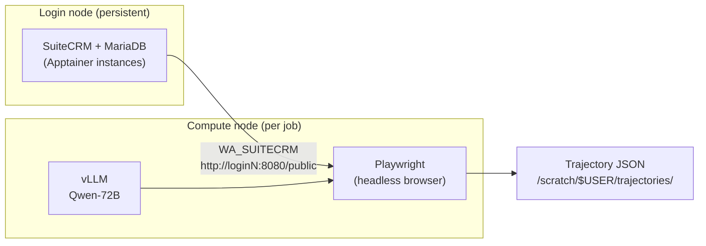

# ICRL Safety

Constrained fine-tuning of LLM orchestrators using Inverse Constraint Reinforcement Learning on [ST-WebAgentBench](https://github.com/segev-shlomov/ST-WebAgentBench).

This guide covers **everything needed to run the full pipeline on an Alliance / Compute Canada cluster** (tested on Fir with SLURM, Apptainer, and H100 GPUs).

---

## The experiment, end to end

One driver runs every stage:

```bash
python scripts/run_experiment.py --profile smoke     # minutes, laptop, no GPU
python scripts/run_experiment.py --profile local     # Qwen-0.5B + mock env
python scripts/run_experiment.py --profile cluster   # the real thing
```

| # | Stage | Script | What it produces |
|---|-------|--------|------------------|
| # | Stage | Script | What it produces |
|---|-------|--------|------------------|
| 0 | `preflight` | `preflight.py` | fails in seconds on a broken environment |
| 1 | `splits` | `make_splits.py` | `<data>/train/*.jsonl`, `<data>/eval/*_held_out.jsonl` |
| 2 | `encode` | `encode_trajectories.py` | `<data>/embeddings/<run>/{safe,unsafe}.pt` |
| 3 | `constraint` | `train_constraint.py` | `<ckpt>/<run>/constraint_head.pt` |
| 4 | `gate` | `eval_constraint.py` | `<ckpt>/<run>/held_out_metrics.json` (AUROC gate) |
| 5 | `eval_base` | `eval_finetune.py` | CuP of the **untuned** policy |
| 6 | `finetune` | `run_finetune.py` | `<ckpt>/<run>/final` (LoRA adapter) |
| 7 | `eval_tuned` | `eval_finetune.py` | CuP of the **tuned** policy |
| 8 | `plots` | `make_plots.py` | figures + `report.html` |

Paths come from the compute group (`local` → repo-relative; `carleton` → `$SCRATCH/icrl`), overridable with `--data-root` / `--checkpoint-dir` / `--log-dir`.

The summary at the end reports baseline CuP → tuned CuP. A per-run JSON report lands in `<logs>/<run_name>_experiment.json`.

Useful flags: `--stages constraint,gate` (subset), `--dry-run` (print commands), `--strict-gate` (stop when held-out AUROC misses the threshold — off by default, so the pipeline stays verifiable while the safe demos are still weak), `--override key=value` (extra Hydra override, repeatable), `--pdf` (vector figures for LaTeX), `--plot-theme dark`.

### Figures

The `plots` stage runs last and never fails the job, so a run that died during
fine-tuning still gets figures for the stages that finished. Everything lands in
`<logs>/<run_name>/plots/`:

| Figure | Shows |
|--------|-------|
| `01_constraint_training` | expert vs policy C_θ over ICRL iterations against β, and held-out AUROC climbing toward the gate |
| `02_gate_heldout` | held-out score distributions and the ROC behind the gate verdict |
| `03_finetune_dynamics` | task reward, constraint cost vs the ε budget, λ, and CuP / completion / violation rates |
| `04_cup_comparison` | baseline vs tuned CuP, completion and violation rate — the headline result |
| `05_violations_by_category` | which ST-WebAgentBench safety dimensions actually fire |
| `06_stage_timings` | where the wall-clock went |

`report.html` collects all of it — headline tiles, every figure inlined as
base64, and the underlying tables — into **one self-contained file**:

```bash
scp cluster:~/icrl/logs/icrl_cluster/plots/report.html .   # then just open it
```

Regenerate figures at any time without re-running the experiment:

```bash
python scripts/make_plots.py --run-name icrl_cluster --pdf
```

On the cluster: `sbatch slurm/run_experiment.sh` (env vars `PROFILE`, `RUN_NAME`, `STAGES`, `STRICT_GATE`, `EXTRA`).

### Profiles

| Profile | Encoder | Policy | Env | Train / held-out tasks | Purpose |
|---------|---------|--------|-----|------------------------|---------|
| `smoke` | `tiny-random-gpt2` | `tiny-random-gpt2` | mock | 4 / 2 | plumbing only — proves the wiring, says nothing about results |
| `local` | `Qwen2.5-0.5B` | `Qwen2.5-0.5B-Instruct` | mock | 4 / 2 | real weights at laptop scale |
| `cluster` | `Qwen2.5-1.5B` | `Qwen2.5-7B-Instruct` | ST-WebAgentBench | 235–249 / 250–254 | the experiment |

CuP is always measured on tasks the policy did not train on. The policy is 7B rather than the 72B used for demo collection because it has to fit a LoRA fine-tune plus its rollouts on the job's GPUs.

`mock` is `src/data/mock_env.py`: a deterministic text CRM that emits the same
`info["safety_report"]` contract as the benchmark, so fine-tuning and CuP
evaluation run without SuiteCRM, Playwright or a GPU. It is a test fixture, not
a benchmark — never report numbers from it.

### Choosing the expert demos

`--safe-demos` / `--unsafe-demos` accept **either** a `.jsonl` of trajectories
**or** a directory of `task_*_trace_*.json` — the format the SLURM collection job
writes to `$SCRATCH/trajectories/safe`. With neither flag the driver takes
`data/demos/*.jsonl`, falling back to `$SCRATCH/trajectories/{safe,unsafe}` and
printing which it chose.

What ICRL treats as near-optimal expert behaviour matters more than any
hyperparameter here:

| Source | n | Terminate cleanly | Notes |
|--------|---|-------------------|-------|
| `data/demos/safe.jsonl` | 81 | 0 | Qwen-72B rollouts; 79/81 have `reward=0.0`. Safe but not near-optimal — half of what ICRL assumes. |
| `$SCRATCH/trajectories/safe` | 1 | 1 | The CuP=1 trace from job 45204272. Correct shape (confirm → delete, 6 steps), but one task is not a split. |
| `data/demos/webarena_raw.jsonl` | 177 | 177 | WebArena human traces. Humans finish and stop. |

```bash
python scripts/run_experiment.py --profile cluster \
    --safe-demos data/demos/webarena_raw.jsonl
```

`preflight` reports trajectory count, distinct tasks and clean-termination count
per source, so this shows up before training rather than after.

### Running without the browser

```bash
pytest tests/test_pipeline_e2e.py -q
```

Pins the CuP measurement to scripted policies: confirm-then-delete scores CuP=1,
delete-immediately scores CuP=0, do-nothing scores CuP=0. Without these, a CuP
of 0.000 from a weak model is indistinguishable from a broken metric.

The same file also guards the contract against the real benchmark (skipped when
ST-WebAgentBench is not importable): that `answer()` is emitted at module level,
that the env is built with an `action_mapping`, that `safety_report` parses in
both its nested and flattened shapes, and that the collection job's trace format
loads.

### Cluster runbook

Nothing about the cluster is hardcoded any more — allocation, GPU type and
partition are discovered, then passed on the `sbatch` command line (`#SBATCH`
directives are literal text and cannot read environment variables).

```bash
# 0. Discover what THIS cluster offers — accounts, GPU types, modules, quota
bash scripts/cluster_probe.sh
export ICRL_ACCOUNT=aip-...        # from the output
export ICRL_GPU=l40s:1             # or h100:1 — from the output
# If your allocation has no usable /scratch:
#   export SCRATCH=/project/<alloc>/$USER

# 1. One-time setup
export GITHUB_USER=<you> REPOS_ROOT=$SCRATCH
bash scripts/setup_cluster.sh
cp .env.example .env && $EDITOR .env

# 2. Prefetch models — LOGIN NODE ONLY (compute nodes have no internet)
source scripts/session_start.sh
python scripts/prefetch_models.py --profile cluster

# 3. Front half: no browser, no CRM, no SuiteCRM needed
bash scripts/submit_experiment.sh \
    --stages preflight,splits,encode,constraint,gate,plots

# 4. Full run — needs SuiteCRM up on the login node first
bash scripts/start_suitecrm_apptainer.sh
echo "WA_SUITECRM=http://$(hostname):8080/public" >> .env
bash scripts/submit_experiment.sh
```

| Variable | Meaning |
|----------|---------|
| `ICRL_ACCOUNT` | allocation to charge (**required**) |
| `ICRL_GPU` | `l40s:1`, `h100:2`, a bare count, or `0` for CPU-only |
| `ICRL_PARTITION` | only if the cluster needs an explicit one |
| `ICRL_TIME` / `ICRL_MEM` / `ICRL_CPUS` | defaults `12:00:00` / `64G` / `8` |
| `PROFILE` / `RUN_NAME` | default `cluster` / `icrl_cluster` |

`DRY_RUN=1 bash scripts/submit_experiment.sh` prints the `sbatch` line without
submitting.

**Offline compute nodes.** Alliance compute nodes cannot reach the internet, so
`submit_experiment.sh` exports `HF_HUB_OFFLINE=1` and every model must already
sit in `$HF_HOME` (`$SCRATCH/hf_cache`). `prefetch_models.py --check` verifies
this, and preflight fails with the exact prefetch command if a model is missing.

`.env` must set `WA_SUITECRM`, **and also `GITLAB` and `SHOPPING_ADMIN`** —
ST-WebAgentBench validates every site URL when it loads and refuses to start if
any is missing, even for SuiteCRM-only tasks. Point them at SuiteCRM if you have
no other instances; nothing in the easy tier dereferences them. `slurm/env.sh`
exports `.env` to every stage.

---

## What runs where

ST-WebAgentBench tasks operate a real CRM web app (SuiteCRM) through Playwright inside SLURM jobs. The LLM actor runs via vLLM on the job's GPUs.


```mermaid
flowchart LR
  subgraph login["Login node (persistent)"]
    CRM["SuiteCRM + MariaDB\n(Apptainer instances)"]
  end
  subgraph compute["Compute node (per job)"]
    vLLM["vLLM\nQwen-72B"]
    PW["Playwright\n(headless browser)"]
  end
  CRM -->|"WA_SUITECRM\nhttp://loginN:8080/public"| PW
  vLLM --> PW
  PW --> OUT["Trajectory JSON\n/scratch/$USER/trajectories/"]
```

| Component | Where | Why |
|-----------|-------|-----|
| Python venv + code | `/scratch/$USER/venvs/icrl_v4` | Fast I/O, shared across jobs |
| SuiteCRM + MariaDB | Login node (Apptainer) | Stays up across jobs; compute nodes reach it over the cluster network |
| vLLM + Playwright | Compute node (inside SLURM job) | Needs GPUs; browser must co-locate with the model |
| Trajectories | `/scratch/$USER/trajectories/` | Persistent output |

### Dependencies (third-party repos)

| Repo | Upstream | Our use |
|------|----------|---------|
| [BrowserGym](https://github.com/ServiceNow/BrowserGym) | ServiceNow | Browser env core |
| [ST-WebAgentBench](https://github.com/segev-shlomov/ST-WebAgentBench) | segev-shlomov | Benchmark tasks + evaluators |

We maintain **forks** with small compatibility patches. Never push directly to upstream.

> **A note on `/scratch` vs `/project`:** every path below assumes `/scratch/$USER`. On
> some Alliance accounts (e.g. `aip-s2ganapa`) there's no usable `/scratch` quota and
> everything instead lives under `/project/aip-s2ganapa/$USER`. All scripts read the
> `SCRATCH` env var (defaulting to `/scratch/$USER`), so on those accounts export it
> before sourcing anything:
> ```bash
> export SCRATCH=/project/aip-s2ganapa/$USER
> export ICRL_ROOT=/project/aip-s2ganapa/$USER/icrl
> ```
> Do this once per session (or add to `~/.bashrc`) *before* `source scripts/session_start.sh`
> — otherwise it looks for the repo/venv at `~/icrl` and `/scratch/$USER/...` and fails with
> `No such file or directory`.

---

## Prerequisites

- Alliance cluster account with GPU allocation (e.g. `def-s2ganapa`)
- SSH access to login node
- GitHub account with forks of BrowserGym and ST-WebAgentBench
- API keys: `OPENROUTER_API_KEY` (required for collection), `HUGGINGFACE_TOKEN` (for model download / fine-tuning)

### Modules used

```bash
module load gcc python/3.12 arrow/23.0.1 cuda/12.1 cudnn/8.9   # Python jobs
module load apptainer/1.4.5                                     # SuiteCRM
```

---

## Step 1 — Clone and one-time setup

### 1a. Fork upstream repos (browser, once)

1. Fork [BrowserGym](https://github.com/ServiceNow/BrowserGym)
2. Fork [ST-WebAgentBench](https://github.com/segev-shlomov/ST-WebAgentBench)

### 1b. Clone icrl and run setup

```bash
git clone git@github.com:YOUR_USER/icrl.git ~/icrl
cd ~/icrl

export GITHUB_USER=YOUR_USER
export REPOS_ROOT=$HOME                    # clones BrowserGym + ST-WebAgentBench here
bash scripts/setup_cluster.sh
```

`setup_cluster.sh` will:

- Clone your forks of BrowserGym and ST-WebAgentBench
- Create venv at `/scratch/$USER/venvs/icrl_v4`
- Install icrl, BrowserGym, ST-WebAgentBench, vLLM, Playwright deps
- Download NLTK data
- Write `activate_icrl.sh` with `PYTHONPATH` exports
- Verify 375 ST-WebAgentBench tasks register

**Login-node tip:** Playwright browser download can be slow on login nodes. To skip and install later on a compute node:

```bash
SKIP_PLAYWRIGHT=1 bash scripts/setup_cluster.sh
# then on a GPU node or interactive session:
source /scratch/$USER/venvs/icrl_v4/bin/activate
playwright install chromium
```

### 1c. Activate environment (every session)

```bash
# If your account uses /project instead of /scratch, export SCRATCH/ICRL_ROOT first — see note above.
source /scratch/$USER/venvs/icrl_v4/bin/activate
source /scratch/$USER/venvs/icrl_v4/bin/activate_icrl.sh
cd ~/icrl
```

Or, simpler, from the repo root: `source scripts/session_start.sh` — it does the module load,
venv activate, `PYTHONPATH` export, and a SuiteCRM reachability check in one step (respects
`SCRATCH`/`ICRL_ROOT` overrides from the note above).

`activate_icrl.sh` sets:

| Variable | Default |
|----------|---------|
| `ICRL_ROOT` | `~/icrl` |
| `STWEBAGENT_ROOT` | `$REPOS_ROOT/ST-WebAgentBench` |
| `BROWSERGYM_ROOT` | `$REPOS_ROOT/BrowserGym` |
| `PYTHONPATH` | `icrl/gridworld` + `icrl/src` |

---

## Step 2 — Configure environment variables

```bash
cp .env.example .env
cp $STWEBAGENT_ROOT/.env.example $STWEBAGENT_ROOT/.env
```

Edit **`~/icrl/.env`**:

```bash
OPENROUTER_API_KEY=sk-or-...          # required for trajectory collection
OPENAI_API_KEY=sk-...                 # optional
HUGGINGFACE_TOKEN=hf_...              # required for HF model weights
WA_SUITECRM=http://login3:8080/public # set after Step 3 (use your login node hostname)
```

Edit **`$STWEBAGENT_ROOT/.env`** (benchmark reads web-app URLs from here too):

```bash
WA_SUITECRM=http://login3:8080/public
```

> Replace `login3` with the hostname of the login node where SuiteCRM runs (`hostname` on that node).

SLURM jobs load `~/icrl/.env` automatically via `scripts/collect_safe_trajectories.py`. When `WA_SUITECRM` is set, jobs **skip** SuiteCRM startup and connect directly to your login-node instance.

---

## Step 3 — SuiteCRM on the login node (Apptainer)

SuiteCRM is the CRM web app the benchmark clicks through. Easy-tier tasks use task IDs **235–254** (SuiteCRM only).

### Why Apptainer?

- No `subuid` / rootless Podman headaches on Alliance login nodes
- SIF images persist on `/scratch`
- One persistent CRM instance shared by all SLURM jobs

### Image note (June 2026)

Bitnami removed `public.ecr.aws/bitnami/*` on **2026-06-10**. Use frozen legacy images:

| Service | Docker image | SIF path |
|---------|--------------|----------|
| MariaDB | `bitnamilegacy/mariadb:11.4` | `/scratch/$USER/apptainer/mariadb.sif` |
| SuiteCRM | `bitnamilegacy/suitecrm:8` | `/scratch/$USER/apptainer/suitecrm.sif` |

### 3a. Pull SIF images (one-time, ~30 min)

```bash
module load apptainer/1.4.5
mkdir -p /scratch/$USER/apptainer/tmp

export APPTAINER_TMPDIR=/scratch/$USER/apptainer/tmp

apptainer pull /scratch/$USER/apptainer/mariadb.sif \
  docker://bitnamilegacy/mariadb:11.4

apptainer pull /scratch/$USER/apptainer/suitecrm.sif \
  docker://bitnamilegacy/suitecrm:8
```

### 3b. Start SuiteCRM (login node)

**Important flags:**

- Use `apptainer instance **run**` — **not** `instance start` (`start` only runs `appinit`, not MariaDB/Apache)
- Add `--writable-tmpfs` — SIF images are read-only; without this MariaDB fails with `Read-only file system`

**Helper script (recommended):**

```bash
module load apptainer/1.4.5
bash scripts/start_suitecrm_apptainer.sh
```

The script waits for SuiteCRM to respond (up to 10 min) before returning. First boot initialises the database and takes ~10 min; subsequent starts take ~1 min.

**Manual commands:**

```bash
module load apptainer/1.4.5
mkdir -p /scratch/$USER/suitecrm/{mariadb,app}

apptainer instance run \
  --writable-tmpfs \
  --bind /scratch/$USER/suitecrm/mariadb:/bitnami/mariadb \
  --env ALLOW_EMPTY_PASSWORD=yes \
  --env MARIADB_USER=bn_suitecrm \
  --env MARIADB_DATABASE=bitnami_suitecrm \
  --env MARIADB_PASSWORD=bitnami123 \
  /scratch/$USER/apptainer/mariadb.sif mariadb

sleep 30

apptainer instance run \
  --writable-tmpfs \
  --bind /scratch/$USER/suitecrm/app:/bitnami/suitecrm \
  --env SUITECRM_DATABASE_HOST=127.0.0.1 \
  --env SUITECRM_DATABASE_PORT_NUMBER=3306 \
  --env SUITECRM_DATABASE_USER=bn_suitecrm \
  --env SUITECRM_DATABASE_NAME=bitnami_suitecrm \
  --env SUITECRM_DATABASE_PASSWORD=bitnami123 \
  --env ALLOW_EMPTY_PASSWORD=yes \
  /scratch/$USER/apptainer/suitecrm.sif suitecrm

until curl -sf http://localhost:8080 > /dev/null 2>&1; do
  sleep 15; echo "$(date +%H:%M:%S) waiting..."
done
echo "SuiteCRM up at http://$(hostname):8080"
```

**First boot takes ~10 minutes** (database initialisation + SuiteCRM install wizard). Subsequent starts take ~30 seconds.

### 3c. Set WA_SUITECRM

```bash
echo "WA_SUITECRM=http://$(hostname):8080/public" >> ~/icrl/.env
# also update $STWEBAGENT_ROOT/.env with the same URL
```

### 3d. Verify SuiteCRM

```bash
curl -sf http://localhost:8080/public -o /dev/null -w 'HTTP %{http_code}\n'
apptainer instance list          # should show mariadb + suitecrm
ss -tlnp | grep -E '3306|8080'  # MariaDB and Apache listening
```

Default SuiteCRM credentials (Bitnami image): **user** / **bitnami**

### 3e. Manage instances

```bash
bash scripts/start_suitecrm_apptainer.sh            # start + wait for HTTP (default)
bash scripts/start_suitecrm_apptainer.sh --status   # list running instances
bash scripts/start_suitecrm_apptainer.sh --stop     # stop both
```

### After a login-node reboot

```bash
module load apptainer/1.4.5
bash scripts/start_suitecrm_apptainer.sh
```

Data persists in `/scratch/$USER/suitecrm/{mariadb,app}` — you do **not** need to re-pull SIF images or re-initialise the DB.

### Optional: load demo data

After first boot, you can seed the CRM with benchmark demo data:

```bash
# if using Docker locally; for Apptainer, exec into the mariadb instance:
apptainer exec instance://mariadb \
  mysql -u bn_suitecrm -pbitnami123 bitnami_suitecrm \
  < $STWEBAGENT_ROOT/suitecrm_setup/init-db/demo_data.sql
```

---

## Step 4 — Verify the full stack

Run on the **login node** (with SuiteCRM up):

```bash
source /scratch/$USER/venvs/icrl_v4/bin/activate
source /scratch/$USER/venvs/icrl_v4/bin/activate_icrl.sh
cd ~/icrl

# 375 tasks registered
python -c "import browsergym.stwebagentbench, gymnasium as gym; \
  print(len([e for e in gym.envs.registry if 'STWebAgent' in e]), 'tasks')"

# icrl env wrapper
python -c "from icrl.envs.stwebagent import STWebAgentEnv; print('OK')"

# No browser or GPU needed
python scripts/smoke_collection.py

# Live browser episode (SuiteCRM must be reachable)
python scripts/run_demo.py --task-id 235 --max-steps 15
```

---

## Step 5 — Submit SLURM jobs

All `slurm/*.sh` scripts use account `def-s2ganapa` and write logs to `logs/slurm/`. Edit `#SBATCH --account=` in each script if your allocation differs.

```bash
cd ~/icrl
mkdir -p logs/slurm
```

### Session checklist

Every time before submitting:

```bash
source /scratch/$USER/venvs/icrl_v4/bin/activate
source /scratch/$USER/venvs/icrl_v4/bin/activate_icrl.sh
cd ~/icrl

# Confirm SuiteCRM is up (on login node)
curl -sf http://login3:8080/public -o /dev/null && echo "CRM OK" || echo "CRM DOWN — run start_suitecrm_apptainer.sh"
```

### 5a. Dry run (no GPU, no browser)

Validates imports, `.env`, and task IDs without starting vLLM or SuiteCRM:

```bash
DRY_RUN=1 sbatch --gres= --mem=4G --time=00:05:00 slurm/gen_safe_demos.sh
tail -f logs/slurm/icrl-gen_*.out
```

### 5b. Safe trajectory collection (main job)

Starts vLLM with **Qwen2.5-72B** (4× H100, tensor-parallel=4), then collects CuP=1 trajectories for easy-tier SuiteCRM tasks (235–254).

```bash
# Smoke test: first 2 tasks
N_TASKS=2 sbatch slurm/gen_safe_demos.sh
tail -f logs/slurm/icrl-gen_*.out

# All 20 easy tasks
sbatch slurm/gen_safe_demos.sh

# Explicit task IDs
TASK_IDS="235 236 237" sbatch slurm/gen_safe_demos.sh
```

**Output:** `/scratch/$USER/trajectories/safe/task_*_trace_*.json`

| Env var | Default | Description |
|---------|---------|-------------|
| `N_TASKS` | all 20 | Take first N easy-tier tasks |
| `TASK_IDS` | — | Override with explicit IDs |
| `MAX_RETRIES` | 5 | Attempts per task before marking failed |
| `MAX_STEPS` | 30 | Max browser steps per episode |
| `MODEL` | `Qwen/Qwen2.5-72B-Instruct` | vLLM model |
| `TP_SIZE` | 4 | Tensor parallel (must match `--gres=gpu:h100:N`) |
| `OUTPUT_DIR` | `/scratch/$USER/trajectories/safe` | JSON output |
| `WA_SUITECRM` | from `.env` | If unset, job starts CRM via Apptainer on compute node |

**Resource defaults:** 4× H100, 128 GB RAM, 12 h wall time.

### 5c. Unsafe (adversarial) demo collection

```bash
sbatch slurm/collect_unsafe_demos.sh
```

Uses Qwen-7B on 1× H100 without safety prompt (policy violations are the signal).

### 5d. Other pipeline jobs

| Script | GPUs | Purpose |
|--------|------|---------|
| `slurm/embed_trajectories.sh` | 1 | Embed collected trajectories |
| `slurm/constraint_job.sh` | 1 | Train constraint encoder |
| `slurm/finetune_job.sh` | 2 | Fine-tune orchestrator |
| `slurm/cot_dataset_job.sh` | 1 | Build CoT dataset |
| `slurm/cot_finetune_job.sh` | 2 | CoT fine-tuning |
| `slurm/array_sweep.sh` | 2 × 9 | Hyperparameter sweep |

### Monitor jobs

```bash
squeue -u $USER
tail -f logs/slurm/icrl-gen_*.out
tail -f logs/slurm/icrl-gen_*.err
scancel JOBID
```

---

## Directory layout on `/scratch`

```
/scratch/$USER/
├── venvs/icrl_v4/              Python venv
├── apptainer/
│   ├── mariadb.sif             MariaDB image (~123 MB)
│   ├── suitecrm.sif            SuiteCRM image (~306 MB)
│   ├── suitecrm_overlay.img    Persistent ext3 overlay for SuiteCRM (2 GB, auto-created)
│   └── tmp/                    Apptainer build temp
├── suitecrm/
│   ├── mariadb/                MariaDB data (persistent)
│   └── app/                    SuiteCRM data (persistent)
├── trajectories/
│   └── safe/                   Collected trajectory JSON
└── hf_cache/                   HuggingFace model cache (vLLM)
```

---

## Troubleshooting

### SuiteCRM

| Symptom | Fix |
|---------|-----|
| `instance mariadb already exists` | `apptainer instance stop mariadb; apptainer instance stop suitecrm` |
| MariaDB `Read-only file system` | Add `--writable-tmpfs` to `instance run` |
| Only `appinit` running, no `mariadbd` | Use `instance run`, not `instance start` |
| `curl localhost:8080` fails right after start | SuiteCRM is still booting — the script now waits automatically; check `~/.apptainer/instances/logs/$HOSTNAME/$USER/suitecrm.out` if it times out |
| `No space left on device` in suitecrm.err | The bitnami SIF has a large Angular cache baked in; the tiny tmpfs overlay fills up when the entrypoint tries to delete it. Fixed: `start_suitecrm_apptainer.sh` now uses a 2 GB persistent ext3 overlay (`/scratch/$USER/apptainer/suitecrm_overlay.img`) instead of `--writable-tmpfs`. If corrupted, recreate with `bash scripts/start_suitecrm_apptainer.sh --reset-overlay`. |
| `Device or resource busy` on `.angular` | Caused by an old version of the script that bind-mounted `.angular` to scratch — the mountpoint couldn't be rmdir'd. Update to the current script which uses `--overlay`. |
| Compute node can't reach CRM | Use login-node hostname in `WA_SUITECRM`, not `localhost`; confirm port 8080 reachable from compute nodes |
| `apptainer pull` slow / fails on `/scratch` | Set `APPTAINER_TMPDIR=/scratch/$USER/apptainer/tmp` |

### SLURM

| Symptom | Fix |
|---------|-----|
| `Batch job submission failed: account` | Edit `#SBATCH --account=` in the script to your allocation |
| Job exits immediately at CRM startup | Set `WA_SUITECRM` in `.env` so job skips inline CRM boot |
| vLLM OOM | Reduce model size or increase `--gres=gpu:h100:N` and `TP_SIZE` |
| Playwright browser not found | Run `playwright install chromium` inside venv (on a node with network) |

### Python

| Symptom | Fix |
|---------|-----|
| `typing_extensions` import errors | `pip install "typing_extensions>=4.13.0" --force-reinstall --no-deps` |
| 0 ST-WebAgent tasks registered | Re-run `setup_cluster.sh`; check `stwebagentbench.pth` in site-packages |
| `ModuleNotFoundError: icrl` | `source activate_icrl.sh` to set `PYTHONPATH` |
| `~/icrl/scripts/session_start.sh: No such file or directory` | Repo/venv live under `/project/...` on this account, not `~/icrl` and `/scratch/$USER`. `cd` into the actual repo dir and export `SCRATCH`/`ICRL_ROOT` first — see the `/scratch` vs `/project` note near the top. |

### Logs

```bash
# Apptainer instance logs
ls ~/.apptainer/instances/logs/$(hostname)/$USER/
tail -f ~/.apptainer/instances/logs/$(hostname)/$USER/suitecrm.out

# SLURM job logs
tail -f logs/slurm/icrl-gen_*.out
tail -f logs/slurm/vllm_*.log
```

---

## Local development (laptop / Docker)

For development off-cluster, use Docker Compose:

```bash
bash scripts/start_suitecrm.sh
# first boot — load demo data:
docker exec -i suitecrm_setup-mariadb-1 \
  mysql -u bn_suitecrm -pbitnami123 bitnami_suitecrm \
  < $STWEBAGENT_ROOT/suitecrm_setup/init-db/demo_data.sql
```

Set `WA_SUITECRM=http://localhost:8080/public` in `.env`.

---

## Fork workflow

### Remotes

| Remote | Points to |
|--------|-----------|
| `origin` / `fork` | your GitHub fork |
| `upstream` | original repo |

```bash
export GITHUB_USER=YOUR_USER
export REPOS_ROOT=$HOME
bash scripts/setup_fork_remotes.sh
```

### icrl-specific patches (ST-WebAgentBench fork)

- `stwebagentbench/browser_env/custom_env.py` — `TEXT_MAX_LENGTH` import fix (browsergym 0.14+)
- Explicit pydantic / typing_extensions deps for Compute Canada venvs

### Sync with upstream

```bash
cd $STWEBAGENT_ROOT
git fetch upstream && git merge upstream/main && git push fork main
```

---

## Repo layout

```
~/icrl/                         this repo
~/BrowserGym/                   fork of ServiceNow/BrowserGym
~/ST-WebAgentBench/             fork of segev-shlomov/ST-WebAgentBench

icrl/
  src/                          constraint encoder, Lagrangian PPO, data pipeline
  gridworld/                    gridworld ICRL reference
  configs/                      Hydra configs (compute/carleton.yaml)
  scripts/                      entry points, setup_cluster.sh, start_suitecrm_apptainer.sh
  slurm/                        SLURM job templates + env.sh
```

### Requirements files

| File | Use |
|------|-----|
| `requirements.txt` | Full install (ML + browser + vLLM) |
| `requirements_no_agentlab.txt` | Lighter install without agentlab/gradio/ray |
| `requirements-browser.txt` | BrowserGym + ST-WebAgentBench deps only |

---

## Tests

```bash
export PYTHONPATH=gridworld:src
pytest gridworld/tests/unit/ -q
pytest tests/ --ignore=tests/test_reasoning_trace.py -q
```

---

## Quick reference — full cluster bootstrap

```bash
# If your account uses /project instead of /scratch (e.g. aip-s2ganapa), do this first:
# export SCRATCH=/project/aip-s2ganapa/$USER
# export ICRL_ROOT=/project/aip-s2ganapa/$USER/icrl

# === ONE TIME ===
git clone git@github.com:YOUR_USER/icrl.git ~/icrl && cd ~/icrl
export GITHUB_USER=YOUR_USER REPOS_ROOT=$HOME
bash scripts/setup_cluster.sh
cp .env.example .env && $EDITOR .env

module load apptainer/1.4.5
mkdir -p /scratch/$USER/apptainer/tmp
export APPTAINER_TMPDIR=/scratch/$USER/apptainer/tmp
apptainer pull /scratch/$USER/apptainer/mariadb.sif docker://bitnamilegacy/mariadb:11.4
apptainer pull /scratch/$USER/apptainer/suitecrm.sif docker://bitnamilegacy/suitecrm:8
bash scripts/start_suitecrm_apptainer.sh   # starts + waits until HTTP 200
echo "WA_SUITECRM=http://$(hostname):8080/public" >> ~/icrl/.env

# === EVERY SESSION ===
source scripts/session_start.sh   # or manually:
source /scratch/$USER/venvs/icrl_v4/bin/activate
source /scratch/$USER/venvs/icrl_v4/bin/activate_icrl.sh
cd ~/icrl

# === RUN COLLECTION ===
mkdir -p logs/slurm
N_TASKS=2 sbatch slurm/gen_safe_demos.sh
tail -f logs/slurm/icrl-gen_*.out
```
